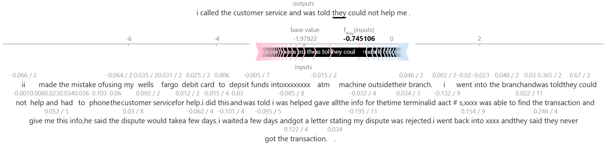

# Intelligent Complaint Analysis for Financial Services

[](https://github.com/nuhaminae/Intelligent-Complaint-Analysis-for-Financial-Services/actions/workflows/CI.yml)


## Overview

Intelligent Complaint Analysis for Financial Services is an advanced platform tailored for the automatic analysis, categorisation, and reporting of customer complaints within the financial sector. The system aims to streamline the identification of key issues, sentiment, and trends in customer feedback by leveraging natural language processing (NLP) and machine learning techniques. Ultimately the complaint analysis system helps financial institutions to improve their service quality and regulatory compliance.

---

## Key Features

- Exploratory data analysis across product categories and complaint structure
- Customisable text chunking strategy with overlap control.
- SentenceTransformer embeddings using `all-MiniLM-L6-v2`.
- Semantic search over ChromaDB with retrievable metadata.
- Embedding via `sentence-transformers/all-MiniLM-L6-v2`.
- RAG pipeline powered by LangChain with refined prompt engineering.
- Interactive Gradio UI with real-time querying and context display.
- Evaluation matrix with quality scores and commentary.
- CI-integrated test suite for reproducibility and robustness.

---

## Table of Contents

- [Project Background](#project-background)
- [Data Sources](#data-sources)
- [Project Structure](#project-structure)
- [Installation](#installation)
- [Usage](#usage)
- [Insights](#insights)
- [Future Improvement](#future-improvement)
- [Contribution](#contribution)
- [Project Status](#project-status)

---

## Project Background

The financial services industry faces a high volume of customer complaints daily, many of which contain crucial insights into systemic issues, regulatory risks, or opportunities for improvement. Manual analysis is labour-intensive and prone to oversight.

This project aims to reduce that time from days to minutes by building a RAG-powered chatbot that retrieves relevant complaint excerpts and generates grounded answers. The system is designed to support internal teams in making faster, evidence-based decisions.

---

## Business Impact

This project transforms that workflow by introducing a Retrieval-Augmented Generation (RAG) chatbot that enables:

### 🔹 Faster Decision-Making

- Internal teams can now query complaints in natural language and receive grounded, formal responses in seconds.
- Multi-turn support allows deeper exploration of issues without restarting the query.

### 🔹 Improved Visibility

- Metadata-enriched embeddings allow filtering by product and issue category, helping teams pinpoint recurring pain points.
- Sentence-aware chunking ensures semantic fidelity, surfacing the most relevant complaint excerpts.

### 🔹 Operational Efficiency

- Manual review time reduced significantly for common queries. The chatbot can handle these in seconds.
- The chatbot supports up to 3 follow-up questions, streamlining multi-layered investigations.

### 🔹 Regulatory Readiness

- Complaint narratives are traceable to their source, supporting auditability and compliance reporting.
- Optional grammar and factuality scoring ensures responses meet internal communication standards.

### 🔹 Scalable Deployment

- The system is modular, CI-integrated, and ready for deployment via Hugging Face Spaces.
- Non-technical users can interact via a Gradio UI with dropdown filters and source transparency.

---

## Data Sources

The project uses real-world complaint data from the Consumer Financial Protection Bureau (CFPB). Each record includes:

- A free-text narrative from the consumer
- Product and company metadata
- Submission dates and issue labels

The dataset was filtered to include only the five target products (Credit card, Personal loan, Buy Now, Pay Later (BNPL), Savings account, Money transfers) and cleaned to remove empty narratives.

---

## Project Structure

The repository is organised as follows:

```bash
├── .chatvenv/                         # Virtual environment (not pushed)
├── .dvc/                              # Data Version Control
├── .github/workflows                  # CI workflows
├── data/                              # Data files
├── model/                             # Model files
├── notebooks/                         # Notebooks
├── plots/                             # Plots and charts for reporting
├── scripts/                           # Core scripts
├── tests/                             # Unit and pytest
├── .dvcignore                         # Ignore DVC files
├── .flake8                            # Flake8 configuration
├── .gitignore                         # Ignore unnecessary files
├── .pre-commit-config.yaml            # Pre-commit configuration
├── .trunkignore                       # Ignore trunk files
├── .yamllint.yml                      # YAML lint configuration
├── app.py                             # Main Gradio application script
├── format.ps1                         # Formatting script
├── pyproject.toml                     # Project configuration
├── README.md                          # Project overview and setup instructions
└── requirements.txt                   # Python package dependencies
```

---

## Installation

### Prerequisites

- Python 3.8 or newer (Python 3.11 recommended)
- `pip` (Python package manager)
- [DVC](https://dvc.org/) (for data version control)
- [Git](https://git-scm.com/)

---

### Setup

```bash
# Clone repo
git clone https://github.com/nuhaminae/Intelligent-Complaint-Analysis-for-Financial-Services.git
cd Intelligent-Complaint-Analysis-for-Financial-Services
____________________________________________
# Create and activate virtual environment
python -m venv .chatvenv
.chatvenv\Scripts\activate      # On Windows
source .chatvenv/bin/activate   # On Unix/macOS
____________________________________________
# Install dependencies
pip install -r requirements.txt
____________________________________________
# Install and activate pre-commit hooks
pip install pre-commit
pre-commit install
____________________________________________
# (Optional) Pull DVC data
dvc pull
```

---

## Usage

1. **Prepare data**
   - Place complaint data in the `data/raw` directory, ensuring it matches the expected format.

2. **Run jupyter notebooks**
   - Open with Jupyter or VSCode to navigate the workflow interactively.
   - Run notebook in `notebooks/` in chronological order for exploratory and iterative development:

      - Run the EdA notebook to explore the data and perform initial preprocessing.

      ```bash
      notebooks/01_eda_preprocessing.ipynb
      ```

      - Run the chunking notebook to create text chunks for embedding.

      ```bash
      notebooks/02_chunking.ipynb
      ```

      - Run the embedding and indexing notebook to create embeddings and build the FAISS index.

      ```bash
      notebooks/03_embedding_and_indexing.ipynb
      ```

      - Run the RAG core logic notebook to implement the retrieval-augmented generation (RAG) approach.

      ```bash
      notebooks/04_rag_core_logic.ipynb
      ```

      - Run the fine-tuning notebook to improve the RAG model.

      ```bash
      notebooks/05_finetuning_rag.ipynb
      ```

      - Run the SHAP analysis notebook to explain model predictions.

      ```bash
      notebooks/06_shap_visualiser.ipynb
      ```

      - Run the business implications notebook to assess the impact of complaints on business metrics.

      ```bash
      notebooks/07_business_implications.ipynb
      ```

3. **View curves**
   - Generated plots will be available in the `plots/` directory or as specified by your script parameters.

4. **Scripts and Tests**
   - Explore `scripts/` and `tests/` directory to interact with script and test suits.

5. **Interactive APP**
   - Features:
      - Input box for natural-language questions
      - Answer powered by RAG + semantic retrieval
      - Source chunks displayed beneath answer
      - Dropdown filters for product and issue category
      - Conversation history retention for up to 3 follow-up questions
      - Optional streaming with token-by-token output

   ```bash
   python app.py
   ```

6. **Code Quality and Linting**
    This project uses pre-commit hooks to automatically format and lint `.py` and `.ipynb` files using:

    |Tool       | Purpose                                       |
    |:----------|-----------------------------------------------|
    | Black     |Enforces consistent code formatting            |
    | isort     |Sorts and organises import statements          |
    | Flake8    |Lints Python code for style issues             |
    | nbQA      |Runs Black, isort, and Flake8 inside notebooks |

    ``` bash
    # Format and lint all scripts and notebooks
    pre-commit run --all-files
    ```

---

## Insights

### EDA & Chunking


Less than half of complaints included narratives, highlighting the need for improved data collection methods.

---


The distribution of complaints by product shows significant variation, indicating areas for targeted improvement.

---


The length of complaints varies widely, with some being very brief and others quite detailed. This affects the effectiveness of automated analysis.

---


The distribution of chunk lengths shows that most chunks are relatively short, with a few outliers that are much longer. This could affect the performance of the embedding model.

---


The distribution of chunk lengths for different product types reveals insights into how complaints are segmented and informs targeted improvements.

---

### RAG Implementation

- The evaluation of the RAG system was conducted using a set of predefined questions and manually scored answers.
- The answers from the evaluation were scored and the complaint-response-pair were used to finetune  `google/flan-t5-base` model.
- Evaluation table is located at `data/evaluation/rag_evaluation.csv` and `data/evaluation/rag_evaluation.md`. It includes:
      - Questions used (20)
      - Answers generated
      - Source documents pulled
      - Manual score (1–5)
      - Commentary

| Question                                      | Generated Answer (Summary)                                                     | Quality Score | Commentary                                                                 |
|----------------------------------------------|---------------------------------------------------------------------------------|---------------|----------------------------------------------------------------------------|
| Why are users unhappy with payday loans?     | Misleading practices and hidden fees trap users in debt cycles.                 | 5             | Strong abstraction across sources; captures core sentiment fluently.      |
| Do customers report unexpected fees?         | Fees deducted unexpectedly from paychecks, contradicting loan terms.            | 4             | Clear answer, but closely mirrors one complaint without summarising.      |
| What are the most common credit card issues? | Billing disputes, fraud, credit limit reductions, and privacy concerns.         | 4             | Informative, but lifted directly from a retrieved source.                 |
| Are savings accounts being frozen?           | Account freezes cause financial stress; users demand clear explanations.        | 4             | Accurate but lacks synthesis; echoes one complaint nearly verbatim.       |
| Are users misled about promotional offers?   | Promotions are unclear or contradictory, leading to unexpected charges.         | 5             | Well-summarised across multiple complaints; captures systemic issue.      |
| Do users face refund delays?                 | Refunds are delayed without clear updates, violating consumer protection norms. | 5             | Strong generalisation; reflects regulatory framing and user frustration.  |

---

### Fine-Tuned model

The fine tuned model `model_finetuned_flant5_v1` had the following performance trajectory:

| Epoch | Training Loss ↓  | Validation Loss ↓ | ROUGE-L ↑  | Interpretation                                                |
|-------|------------------|-------------------|------------|---------------------------------------------------------------|
| 1     | 41.32            | 40.46             | 0.44       | Initial baseline; low semantic fidelity                       |
| 2     | 32.95            | 35.97             | 0.57       | Major improvement; model begins capturing complaint structure |
| 3     | 30.32            | 33.65             | 0.62       | Strong semantic alignment; nearing optimal fluency            |
| 4     | 28.85            | 32.74             | 0.62       | Plateau reached; stable generalisation                        |

- **Efficiency**: 0.414 samples/sec → suitable for batch inference in real-time dashboards
- **Consistency**: ROUGE scores plateau → predictable output quality across unseen data

> “By Epoch 4, the model reduced validation loss by 19% and improved ROUGE-L by 40% compared to baseline. This indicates reliable semantic compression of financial complaints, enabling faster triage and risk categorisation. The stabilised loss and ROUGE scores suggest the model is production-ready for summarisation tasks with minimal hallucination risk.”

### SHAP (feature explainer)

- **model** is a fine‑tuned summariser (Hugging Face pipeline) aimed at distilling long complaint narratives into short summaries.
- **SHAP** is calculating token‑level contributions: for each word or subword token in the input, it measures how much that token nudged the model toward producing the given output text.
- **`shap.plots.text` output** typically highlights input tokens in red/blue (or with opacity) to show their **magnitude and direction** of influence.
- **Text plot** here highlights which words or phrases push the summary toward certain themes (e.g., “unauthorised” → risk, “refund” → resolution).



Looking at the input:
> *ATM deposit issue → went into branch → told to call customer service → customer service took details → dispute opened → later rejected → bank said they never got the transaction.*

The model’s summary:
> *"i called the customer service and was told they could not help me."*

This indicates:

- The summariser latched onto **the customer service refusal moment** as the central, most salient event.
- Other timeline details (ATM deposit, branch visit, dispute rejection) were **ignored or deprioritised** — possibly because the training data rewards short, direct problem statements rather than chronology.

**How SHAP Connects the Dots**:

When we inspect the SHAP plot for the sample run:

- **High‑impact tokens** (likely “called”, “customer service”, “could not help”) will have strong positive SHAP values.
  → This means these words pushed the model toward outputting a sentence about *customer service refusal*.
- **Lower‑impact or negative‑impact tokens** (e.g., ATM location, terminal ID) will be pale or even blue, showing minimal or opposite effect on producing the summary.
- The plot is telling us *which parts of the long complaint most directly influenced the exact phrasing of the summary*.

> "The model decided that the most essential information was the customer service’s inability to assist. SHAP highlights that words related to ‘customer service’ and ‘could not help’ drove this decision, while transaction specifics and timeline details had negligible influence."

### Gradio Integration

- The Gradio interface allows users to interact with the model easily, providing a user-friendly way to input complaints and receive summaries.


---

## Future Improvement

Fine Tuning:

- Adjust summarisation hyperparameters (e.g., `min_length`, `max_length`) or fine‑tune with examples that preserve more event context.
- Consider training with summaries that always include *what happened* + *the outcome*, so SHAP will also show high contributions from tokens about the dispute decision.

---

## Contribution

Contributions are welcome! Please fork the repository and submit a pull request. For major changes, open an issue first to discuss what you would like to change.

Make sure to follow best practices for version control, testing, and documentation.

---

## Project Status

Final submission merged. Checkout the [commit history](https://github.com/nuhaminae/Intelligent-Complaint-Analysis-for-Financial-Services/commits?author=nuhaminae).
